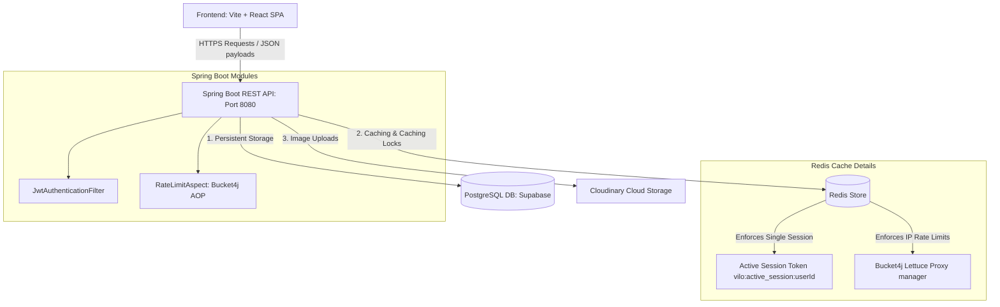

# MinuteMind Backend

MinuteMind is a gamified productivity ecosystem designed to close the gap between long-term goals and daily execution.

---

## 🎯 Overview & Value Proposition

Most productivity tools fail because they are passive. Task managers are static chores, timers run in isolation, and social apps cause distraction. 

**MinuteMind** solves this by establishing a self-reinforcing loop:
```
[Goal] ➔ [Task] ➔ [Focus Session] ➔ [Streak] ➔ [Badge] ➔ [Leaderboard] ➔ [Community Accountability]
```
By turning focused time into gamified rewards and social accountability, MinuteMind transforms procrastination into active, consistent execution.

---

## ✨ Key Features
- **Goal-Oriented Task Management**: Define macro goals (e.g. learning Spring Boot) and split them into subtasks. Focused time spent on subtasks is dynamically aggregated to measure goal progress.
- **Real-Time Focus Sessions**: Run timers (defaulting to 25-minute Pomodoro blocks) backed by a backend **Heartbeat** mechanism to validate actual focus time and prevent cheating.
- **Redis-Backed Session Lock**: Uses Redis to cache and enforce a single active focus session per user, ensuring single-tasking discipline.
- **Daily Focus Streaks**: Tracks daily streaks with customizable minute thresholds. Missing a day resets the streak.
- **Gamified Achievements**: Automatically check and unlock collectible badges (ranging from *Common* to *Legendary*) based on consecutive streaks or total focus minutes.
- **Social Accountability**:
  - **Shared Goals**: Collaborate on goals with mutual friends (up to 10 members), tracking each other's today's focus, total goal contribution, and individual progress percentage.
  - **Daily Focus Leaderboards**: Climb the ranks in real-time against friends.
  - **Activity Feed**: View and celebrate completed focus sessions of users you follow.

---

## 💻 Tech Stack
- **Core Framework**: Spring Boot 4.0 (Java 21)
- **Data Access**: Spring Data JPA & Hibernate
- **Database**: PostgreSQL
- **Caching & Caching Lock**: Redis (Lettuce Client)
- **Distributed Rate Limiter**: Bucket4j (using Redis storage state, enforced via custom AOP aspects)
- **File Storage**: Cloudinary integration for profile avatar uploads
- **API Documentation**: Swagger/OpenAPI (Springdoc WebMVC UI)
- **Security**: Stateless Spring Security, JWT (Base64 Key Signature), Refresh Token Rotation (SHA-256 Hashed tokens in DB)

---

## 🏛️ High-Level System Architecture

This diagram outlines the infrastructure configuration and data paths connecting the client app, the Spring Boot API, caches, databases, and third-party cloud engines.



---

## ⚡ Quick Start

Run the entire backend stack (including database and Redis) using Docker Compose.

### 1. Configure Mappings
Create a `.env` file in `minutemind/` (or copy `.env.prod`):
```env
DATABASE_URL=jdbc:postgresql://<db-host>:5432/<db-name>
DB_USERNAME=postgres
DB_PASSWORD=secret_password
JWT_SECRET=fDVidgXxPsgxmQnUPMECjPMLRJAeVZV9YuZpOCoOoBo=
CORS_ORIGINS=http://localhost:5173
CLOUDINARY_CLOUD_NAME=my_cloud
CLOUDINARY_API_KEY=12345
CLOUDINARY_API_SECRET=my_secret
```

### 2. Run with Docker Compose
```bash
cd minutemind
docker compose up -d --build
```
The application will start on port `8080`.
- API Context Path: `http://localhost:8080/api/v1`
- Swagger Documentation: `http://localhost:8080/swagger-ui/index.html`
- Health check: `http://localhost:8080/actuator/health`

---

## 📚 Detailed Documentation Map

To keep the documentation clean and readable, technical and business specifications are split into dedicated files under the `docs/` directory.

### 1. Business & Domain Logic (Level 2: Developers)
- [Domain & Productivity Loop](docs/business/domain.md) - Deep dive into how the core loops interact. Contains: **Productivity Data Flow**.
- [Goals & Tasks Specification](docs/business/goals.md) - Creation, soft-deletes, reordering, and state updates. Contains: **Goal Lifecycle**, **Goal States**, **Task States**.
- [Focus Session Workflows](docs/business/sessions.md) - State machines, Heartbeats, and cleanup mechanisms. Contains: **Focus Session Lifecycle**, **Work Session States**, **Session Management Flow**.
- [Gamification Details](docs/business/gamification.md) - Streak calculations and Badge rules. Contains: **Badge Award Rules**, **Streak Update Workflow**.
- [Community Features](docs/business/community.md) - Social graph, leaderboards, feeds, and Shared Goals. Contains: **Shared Goal Workflow**, **Community Flow**, **Invitation States**.

### 2. System Architecture & Setup (Level 2: Developers)
- [Architecture Overview](docs/architecture/overview.md) - Spring Boot layers, Redis cache, and Bucket4j Rate Limiting aspects. Contains: **System Architecture**, **Package Architecture**, **Request Lifecycle**.
- [Security Architecture](docs/architecture/security.md) - JWT filters, Custom UserDetails, and Refresh Token Rotation. Contains: **JWT Authentication Flow**, **Refresh Token Rotation**.
- [Database Specification](docs/architecture/database.md) - PostgreSQL tables, foreign key structures, and performance indexes. Contains: **Entity Relationship Diagram (ERD)**.
- [Workflow Flowcharts Index](docs/architecture/workflows.md) - Access diagrams index. Contains: **Scheduler & Automation Flow**, **Diagram Index Map**.

### 3. Setup & Deployment (Level 3: Testing & Contributors)
- [Local Development Setup](docs/development/setup.md) - Running the app locally from terminal or IDE.
- [Environment Variables](docs/development/environment.md) - Reference table for all config properties.
- [Docker Configuration](docs/development/docker.md) - Multi-stage Dockerfile and docker-compose options.
- [Testing Guide](docs/development/testing.md) - Test dependencies, running tests, and recommended testing strategy.

### 4. API Reference Endpoints
- [Authentication APIs](docs/api/authentication.md)
- [Goals APIs](docs/api/goals.md)
- [Tasks APIs](docs/api/tasks.md)
- [Sessions APIs](docs/api/sessions.md)
- [Community & Social APIs](docs/api/community.md)
- [Users APIs](docs/api/users.md)
