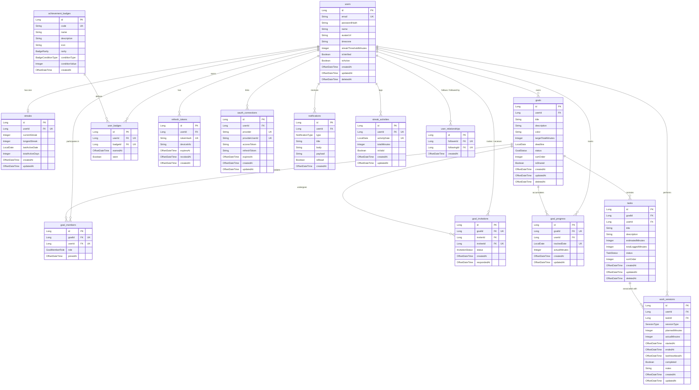

# Database Design Specification

## Entity Relationship Diagram (ERD)

This diagram displays the database schema and entity relationships for the **MinuteMind** backend, mapped from the active JPA entities.

---

## Database Tables & Core Columns

### 1. `users`
Stores user profile credentials, settings, and account status.
- `id` (BIGINT, Primary Key, Auto-Increment)
- `email` (VARCHAR, Unique, Non-nullable)
- `password_hash` (VARCHAR)
- `name` (VARCHAR, Non-nullable)
- `avatar_url` (VARCHAR)
- `timezone` (VARCHAR, Default: 'Asia/Ho_Chi_Minh')
- `streak_threshold_minutes` (INTEGER, Default: 25)
- `is_verified` (BOOLEAN, Default: false)
- `is_active` (BOOLEAN, Default: true)
- `deleted_at` (TIMESTAMP WITH TIME ZONE, Nullable for soft deletes)

### 2. `goals`
Containers for user objectives.
- `id` (BIGINT, Primary Key)
- `user_id` (BIGINT, Foreign Key referencing `users.id`)
- `title` (VARCHAR, Non-nullable)
- `description` (TEXT)
- `color` (VARCHAR, hexadecimal or color code)
- `target_total_minutes` (INTEGER, Nullable target)
- `deadline` (DATE, Nullable)
- `status` (VARCHAR, mapped from `GoalStatus` enum: `ACTIVE`, `PAUSED`, `COMPLETED`, `ARCHIVED`)
- `sort_order` (INTEGER, Default: 0)
- `is_shared` (BOOLEAN, Default: false)
- `deleted_at` (TIMESTAMP WITH TIME ZONE, Nullable)

### 3. `tasks`
Individual tasks that belong to goals.
- `id` (BIGINT, Primary Key)
- `goal_id` (BIGINT, Foreign Key referencing `goals.id`)
- `user_id` (BIGINT, Foreign Key referencing `users.id`)
- `title` (VARCHAR, Non-nullable)
- `description` (TEXT)
- `estimated_minutes` (INTEGER)
- `total_logged_minutes` (INTEGER, Default: 0)
- `status` (VARCHAR, mapped from `TaskStatus` enum: `TODO`, `IN_PROGRESS`, `DONE`)
- `sort_order` (INTEGER, Default: 0)
- `deleted_at` (TIMESTAMP WITH TIME ZONE, Nullable)

### 4. `work_sessions`
Focus and break session records associated with tasks.
- `id` (BIGINT, Primary Key)
- `user_id` (BIGINT, Foreign Key)
- `task_id` (BIGINT, Foreign Key)
- `session_type` (VARCHAR, `WORK` or `BREAK`)
- `planned_minutes` (INTEGER, Non-nullable)
- `actual_minutes` (INTEGER, Default: 0)
- `started_at` (TIMESTAMP WITH TIME ZONE, Non-nullable)
- `ended_at` (TIMESTAMP WITH TIME ZONE, Nullable)
- `last_heartbeat_at` (TIMESTAMP WITH TIME ZONE, Non-nullable)
- `completed` (BOOLEAN, Default: false)
- `notes` (TEXT)

---

## Constraints & Business Safeguards

To maintain data integrity at the database layer, the following **Unique Constraints** are defined:
- **`goal_members`**: Unique composite constraint on `(goal_id, user_id)` ensures a user cannot join the same goal multiple times.
- **`goal_invitations`**: Unique composite constraint on `(goal_id, invitee_id)` restricts invitations to one active/pending invite per user per goal.
- **`goal_progress`**: Unique composite constraint on `(goal_id, tracked_date)` prevents duplicate progress logs for the same goal on the same day.
- **`streak_activities`**: Unique composite constraint on `(user_id, activity_date)` ensures a user has exactly one focus minutes total record per calendar day.
- **`user_badges`**: Unique composite constraint on `(user_id, badge_id)` prevents the duplicate awarding of the same badge.
- **`user_relationships`**: Unique composite constraint on `(follower_id, following_id)` restricts followers to a single association.
- **`oauth_connections`**: Unique composite constraint on `(provider, provider_user_id)` prevents linking a single third-party provider account to multiple local accounts.

---

## Database Performance Indexes

To handle high-frequency reads and writes (such as heartbeats, dashboard loadings, and feeds), the system utilizes the following indexes:

### 1. Work Session Queries
`idx_sessions_user_date` on `(userId, startedAt DESC)`
- **Why**: Speeds up statistics generation, dashboard history queries, and heatmap rendering, which frequently request the user's latest sessions.

`idx_sessions_task` on `(taskId)`
- **Why**: Speeds up aggregation calculations when summing the total logged minutes for a specific task.

### 2. Live Notifications
`idx_notifications_user` on `(userId, isRead, createdAt DESC)`
- **Why**: Speeds up notification inbox rendering, letting the system fetch unread alerts instantly, sorted by the newest first.

### 3. Social Follow Graph
`idx_following` on `(followingId)`
- **Why**: Speeds up lookups on who is following a user, which is critical for compiling daily focus leaderboards and activity feeds.
