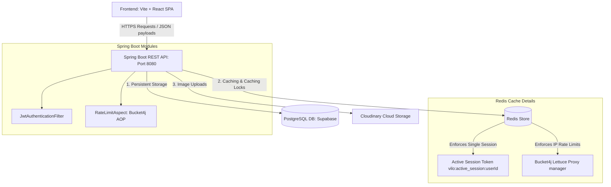
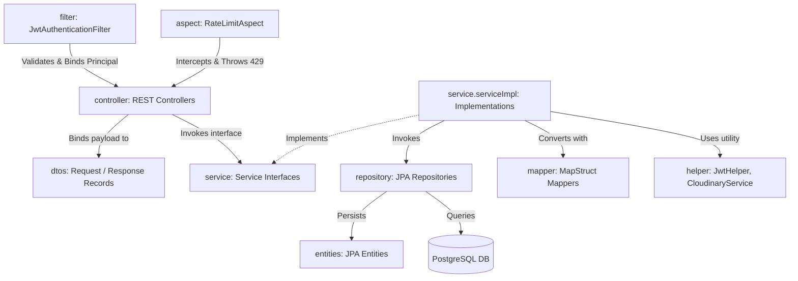
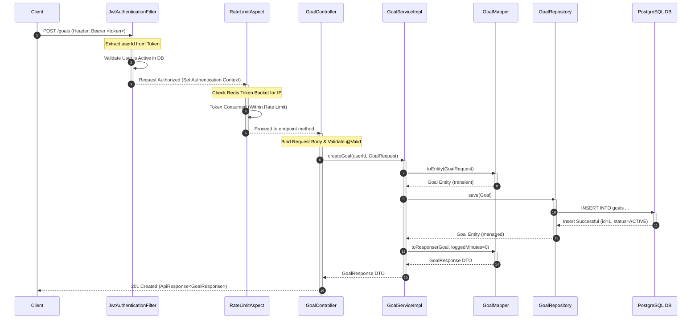

# System Architecture Overview

## High-Level System Architecture

This flowchart outlines the high-level infrastructure layout, indicating data transmission boundaries between the Frontend SPA, the Spring Boot API, and external third-party services.



---

## Package Architecture

This flowchart maps the layout of the Spring Boot package structure, showcasing package dependencies and the data-flow path.

```
[com.be.minutemind]
  ├── annotation (Custom Annotations & Resolvers)
  ├── aspect (AOP Aspects - Rate Limit)
  ├── config (SecurityConfig, WebMvcConfig, Bucket4jConfig)
  ├── controller (REST Entrypoints)
  ├── dtos (request & response records)
  ├── entities (JPA Database Entities)
  ├── enums (GoalStatus, TaskStatus, etc.)
  ├── exception (Global Error Handling)
  ├── filter (Jwt Filter)
  ├── helper (JwtHelper, CloudinaryService)
  ├── mapper (MapStruct Model Mappers)
  ├── repository (Spring Data JPA Repositories)
  └── service (Service Interfaces)
        └── serviceImpl (Workflow Implementations)
```



---

## Request Lifecycle

This sequence diagram illustrates the lifecycle of a typical client request (e.g. creating a goal: `POST /goals`) as it passes through the security filters, rate-limiting aspects, controllers, services, repositories, and the database.



---

## Core Framework & Layer Responsibilities

### 1. Presentation / Controller Layer
- Endpoint routing and CORS checking.
- Maps JSON payloads into Java records (`dtos`).
- Performs input validation (e.g. `@NotBlank`, `@Size`).
- Intercepts requests for custom arguments binding (e.g. `@CurrentUser Long userId`).

### 2. Service / Business Logic Layer
- Orchestrates transaction boundaries using `@Transactional`.
- Evaluates domain-specific permissions (e.g., verifying a user owns a task before updating it).
- Implements calculations, streak checks, and badge awarding logic.

### 3. Data Access / Repository Layer
- Integrates JpaRepository for standard CRUD functions.
- Implements custom query statements.

### 4. Infrastructure Layer
- **Distributed Rate Limiting**: Managed by `Bucket4jConfig` and `RateLimitAspect` leveraging Lettuce Redis connection managers.
- **Stateless Authentication**: Filters JWT Bearer tokens, resolves UserDetails, and handles specific expired/invalid token payloads.
- **Third-Party Storage**: Uploads, deletes, and updates avatars via Cloudinary.
