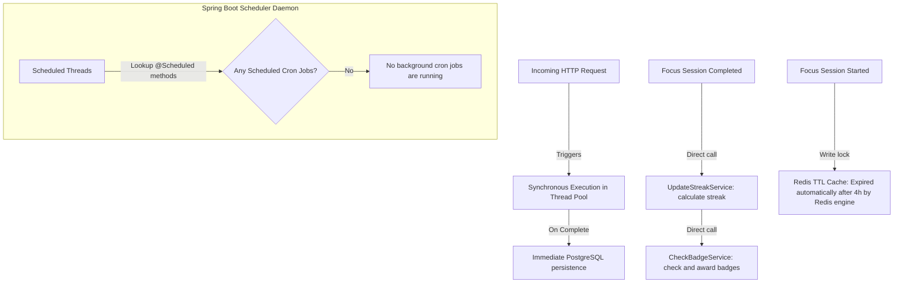

# System Workflows & Automation

## Scheduler & Automation Flow

This diagram illustrates how MinuteMind behaves as an **on-demand, event-driven system** rather than relying on background thread schedulers.

> [!NOTE]
> **No Scheduled Cron Jobs**: This workflow cannot be confidently derived from the current codebase as there are no `@Scheduled` methods or automated background schedulers implemented in the Spring Boot backend. 
> The system operates entirely on **on-demand API requests** and **event-driven service chains** (e.g. updating streaks and evaluation of badges occur synchronously inside the focus completion transaction boundary). Active session timeouts are handled passively via Redis's built-in TTL cache eviction.

---

## Diagram Index Map

Use this directory to quickly access all 18 visual system diagrams embedded throughout the documentation.

### System & Infrastructure Levels
1. **[High-Level System Architecture](../README.md#high-level-system-architecture)** (README.md) - Illustrates the layout of the server, databases, cache, and third-party APIs.
2. **[Package Architecture](overview.md#package-architecture)** (overview.md) - Visualizes Spring Boot package dependencies and layers.
3. **[Request Lifecycle Sequence](overview.md#request-lifecycle)** (overview.md) - Shows the trace of an HTTP request through filters, aspects, controller, service, repository, and database.

### Security & Token Lifecycle
4. **[JWT Authentication Flow](security.md#jwt-authentication-flow)** (security.md) - Sequence of token extraction, database lookups, and Security Context binding.
5. **[Refresh Token Rotation](security.md#refresh-token-rotation)** (security.md) - Sequence mapping token verification, hashing validation, old token invalidation, and new pair rotation.

### Business & Domain Workflows
6. **[Productivity Data Flow](domain.md#productivity-data-flow)** (domain.md) - The core backbone data flow linking Goal ➔ Task ➔ Session ➔ Stats ➔ Streak ➔ Badge ➔ Leaderboard.
7. **[Goal Lifecycle](goals.md#goal-lifecycle)** (goals.md) - Flowchart tracking a goal's creation, task planning, focus tracking, and completion.
8. **[Focus Session Lifecycle](sessions.md#focus-session-lifecycle)** (sessions.md) - Flowchart outlining session states, heartbeat logs, and completion requirements.
9. **[Shared Goal Collaboration](community.md#shared-goal-workflow)** (community.md) - Business rule diagram showing validations, friend chéo requirements, and membership limits.
10. **[Community Graph & Feeds](community.md#community-flow)** (community.md) - Flowchart representing relationships, feed updates, and daily ranking board.
11. **[Badge Award Rules](gamification.md#badge-award-workflow)** (gamification.md) - Flowchart of achievement check conditions.
12. **[Streak Update Calculation](gamification.md#streak-update-workflow)** (gamification.md) - Logic tree parsing daily focus thresholds, date gaps, consecutive increments, and resets.

### Database Schema
13. **[Entity Relationship Diagram (ERD)](database.md#entity-relationship-diagram-erd)** (database.md) - Standard database diagram for all 15 tables and relations.

### State Machines
14. **[Goal State transitions](goals.md#goal-states)** (goals.md) - State diagram for `GoalStatus` values (`ACTIVE`, `PAUSED`, `COMPLETED`, `ARCHIVED`).
15. **[Task State transitions](goals.md#task-states)** (goals.md) - State diagram for `TaskStatus` values (`TODO`, `IN_PROGRESS`, `DONE`).
16. **[Invitation State transitions](community.md#invitation-states)** (community.md) - State diagram for `InvitationStatus` values (`PENDING`, `ACCEPTED`, `DECLINED`, `CANCELLED`).
17. **[Work Session State transitions](sessions.md#work-session-states)** (sessions.md) - State diagram for session lifecycle (`ACTIVE`, `ORPHANED`, `COMPLETED`, `DISCARDED`).

### Operations & Automations
18. **[Scheduler & Automation Flow](#scheduler--automation-flow)** (workflows.md) - Schedulers validation and Redis automatic TTL cache cleanups.
