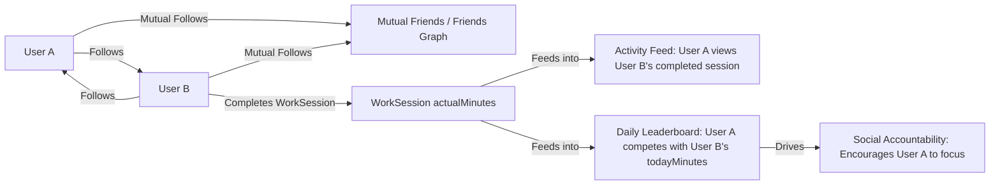
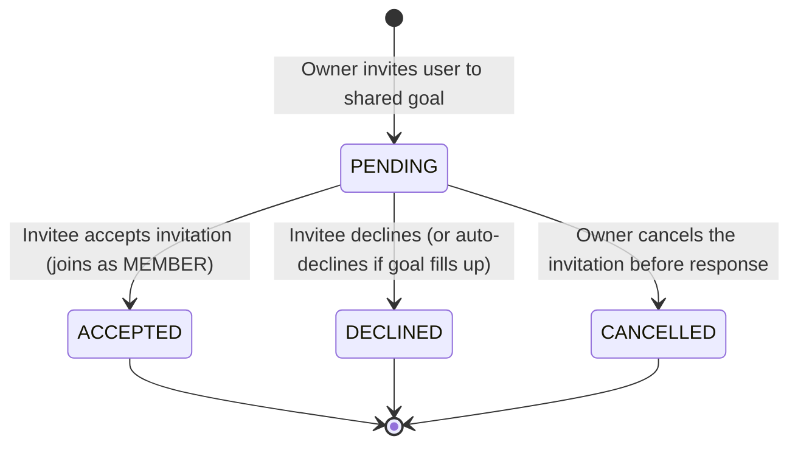

# Community & Social Accountability

## Shared Goal Workflow

This business rule flowchart displays the validation requirements, state progression, and role assignments when collaborating on shared goals.

```mermaid
flowchart TD
    Start([Owner decides to share Goal]) --> Share[POST /community/goals/{id}/share]
    Share --> OwnerMember[Add Owner to goal_members with role: OWNER]
    OwnerMember --> Invite[POST /community/goals/{id}/invitations]
    
    Invite --> Rule1{Is invitee a mutual friend?}
    Rule1 -- No --> FailFriend[Block: Can only invite mutual followers]
    Rule1 -- Yes --> Rule2{Already member or invite pending?}
    
    Rule2 -- Yes --> FailMem[Block: Already member or invite pending]
    Rule2 -- Yes --> Rule3{Current members + Pending < 10?}
    
    Rule3 -- No --> FailLimit[Block: Goal member capacity reached]
    Rule3 -- Yes --> CreateInvite[Create GoalInvitation status: PENDING]
    
    CreateInvite --> Respond[PATCH /community/invitations/{invitationId}]
    Respond --> Action{Accept or Decline?}
    
    Action -- Decline --> SetDeclined[Set status = DECLINED]
    Action -- Accept --> Rule4{Is member count < 10?}
    
    Rule4 -- No --> AutoDecline[Set status = DECLINED, throw Goal Full]
    Rule4 -- Yes --> SetAccepted[Set status = ACCEPTED]
    SetAccepted --> CreateMember[Add User to goal_members with role: MEMBER]
```

---

## Community Flow

This flowchart models the social network interactions, showing how following connections lead to active feed updates and real-time competition.



---

## Invitation States

This state transition diagram represents the valid status states of a Shared Goal invitation, mapped to the `InvitationStatus` enum.



---

## Social Graph: Follows & Mutual Friends

- **Follow Model**: A user can follow any other user by ID (`POST /community/follow/{followingId}`). This creates a record in the `user_relationships` table.
- **Mutual Friends**: A "mutual friend" is defined as a two-way following relationship (User A follows User B, and User B follows User A).
- **Security Check**: This social graph is utilized as a permission boundary:
  - Users can search for other users by name or email.
  - Users can view public profiles (streaks, badges, total minutes, follow status) of anyone in the system.
  - However, **Shared Goal invitations** are strictly restricted to mutual friends to prevent spam.

---

## Daily Leaderboards

The **Daily Focus Leaderboard** (`GET /community/leaderboard/daily`) ranks users based on their output today.
- **Scope**: The leaderboard includes the current user and all users they follow.
- **Calculation**:
  - The system queries work sessions that were completed today (evaluated in the user's timezone or UTC).
  - Users with no sessions today are automatically added to the map with `0` focus minutes.
- **Sorting & Ranking**:
  - Sorted by **minutes completed** (descending).
  - In case of a tie, sorted **alphabetically by name**.
  - Ranks are calculated sequentially (`1`, `2`, `3`...).

---

## Activity Feed

The **Activity Feed** (`GET /community/feed`) displays a live stream of achievements within the user's network.
- **Scope**: Includes the 20 most recent focus sessions completed by users that the current user is following.
- **Content**: Automatically generated messages (e.g., "<User Name> đã hoàn thành 25 phút tập trung") flagged with type `WORK_SESSION`, along with the timestamp and user avatar.

---

## Shared Goals Collaboration Rules

### 1. Enabling Shared Mode
- The goal creator (owner) enables sharing via `POST /community/goals/{id}/share`.
- The backend sets `goal.isShared = true` and adds the owner to the `goal_members` table with the role `OWNER`.

### 2. The Invitation Lifecycle
- **Inviting Members**: The owner sends an invite request.
  - *Validation*: The invitee must be a mutual friend, must not already be a member or have a pending invite, and the combined total of current members + pending invites must be under **10** (`MAX_MEMBERS = 10`).
  - *Outcome*: A `GoalInvitation` is saved in the `PENDING` state, and a notification of type `FRIEND_MILESTONE` containing a JSON payload with `invitationId` and `goalId` is sent.
- **Owner Cancellation**: The owner can cancel any pending invitation (`status = CANCELLED`).
- **Invitee Response**: The invitee can accept or decline the invitation.
  - *Acceptance*: The system re-checks the membership limit. If the goal is not full, the status updates to `ACCEPTED`, and a `GoalMember` record is created with role `MEMBER`. If the goal filled up while the invite was pending, the invite is automatically declined.
  - *Decline*: The status is set to `DECLINED`.

### 3. Membership Management
- **Leaving**: A `MEMBER` can leave the goal at any time. An `OWNER` cannot leave; they must archive the goal instead.
- **Kicking**: The `OWNER` can remove any member from the goal. The owner cannot kick themselves.

### 4. Progress Board
- Any member of a shared goal can view the **Goal Progress Board** (`GET /community/goals/{id}/members`).
- For each member, the board displays:
  - Name and avatar.
  - Focus minutes completed today.
  - Total focus minutes contributed specifically to this goal.
  - Individual progress percentage (calculated as `totalMemberMinutes / goal.targetTotalMinutes * 100%`).
