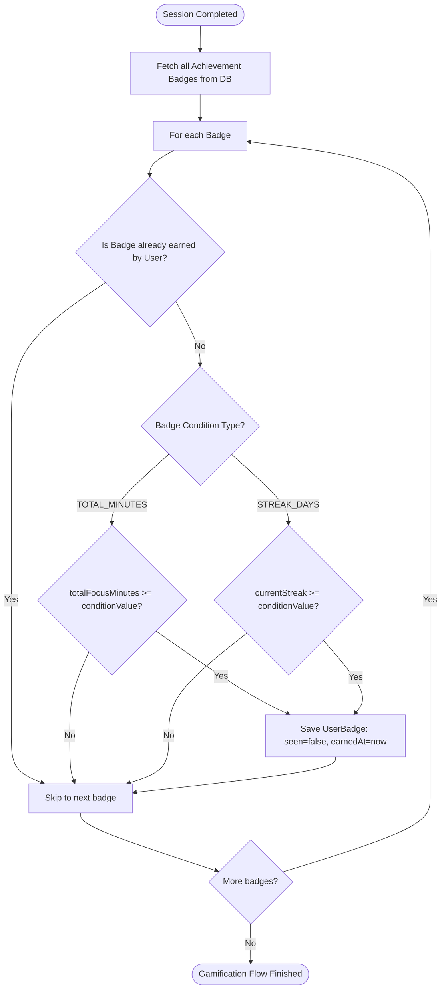
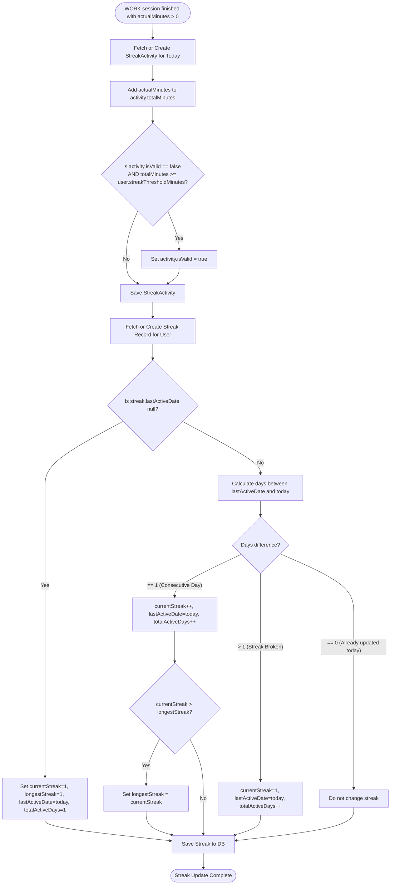

# Gamification: Streaks & Badges

## Badge Award Workflow

This business rule flowchart shows the step-by-step logic applied by the system to check and award badges upon session completion.

---

## Streak Update Workflow

This business flowchart details the daily focus validation process and consecutive day calculations for streaks.

---

## Daily Streaks Business Rules

A **Streak** represents the consecutive number of days a user has successfully met their daily focus goal.

### The Streak Validation Flow
1. **User Threshold**: Each user can set a custom daily target in minutes (`user.streakThresholdMinutes`, defaulting to **25 minutes**).
2. **Daily Activity Logging**:
   - The system tracks daily progress in the `streak_activities` table, keyed by `userId` and `activityDate` (LocalDate).
   - Every completed `WORK` session adds to that day's `totalMinutes`.
3. **Threshold Evaluation**:
   - When the accumulated minutes for the day cross the user's `streakThresholdMinutes`, the day's activity is marked `isValid = true`.
   - The streak record is updated **only at the exact moment** a day transitions from invalid to valid (`newlyValid = true`). This prevents redundant updates and race conditions during subsequent sessions on the same day.

### Streak State Transitions
When a day becomes valid, the system calculates the gap between the current date and the user's `lastActiveDate`:
- **First Day (`lastActiveDate == null`)**: The streak starts.
  - `currentStreak` is set to `1`.
  - `longestStreak` is initialized to `1`.
  - `totalActiveDays` is set to `1`.
- **Consecutive Day (`daysBetween == 1`)**: The streak continues.
  - `currentStreak` increments by `1`.
  - If `currentStreak > longestStreak`, then `longestStreak` is updated.
  - `totalActiveDays` increments by `1`.
- **Streak Broken (`daysBetween > 1`)**: The streak is lost.
  - `currentStreak` resets to `1`.
  - `totalActiveDays` increments by `1`.
- **Same Day (`daysBetween == 0`)**: The streak has already been updated for today. No state changes are made.

---

## Achievement Badges Business Rules

**Badges** are digital awards representing milestones. They are defined in the `achievement_badges` table and earned by users, creating record associations in `user_badges`.

### Badge Attributes
- **Rarity**: Categorized into `COMMON`, `UNCOMMON`, `RARE`, `EPIC`, or `LEGENDARY`.
- **Condition Type**: Specifies the metric evaluated.
- **Condition Value**: The numerical threshold required to unlock the badge.

### Badge Conditions
Currently, the system supports two types of conditions (`BadgeConditionType`):
1. **`TOTAL_MINUTES`**: Unlocked when the sum of all focus session minutes completed by the user (`sumTotalWorkMinutes`) meets or exceeds the target (e.g., 500, 1000, 5000 minutes).
2. **`STREAK_DAYS`**: Unlocked when the user's current consecutive streak (`currentStreak`) meets or exceeds the target (e.g., 3 days, 7 days, 30 days).

### Awarding Mechanics
- Evaluation is triggered immediately after a focus session completes and the streak is updated.
- The system queries all badges in the database.
- It filters out badges the user has already earned.
- For remaining badges, it evaluates the condition. If met, it creates a `UserBadge` link with `seen = false` (to trigger a celebratory popup on the client-side).
