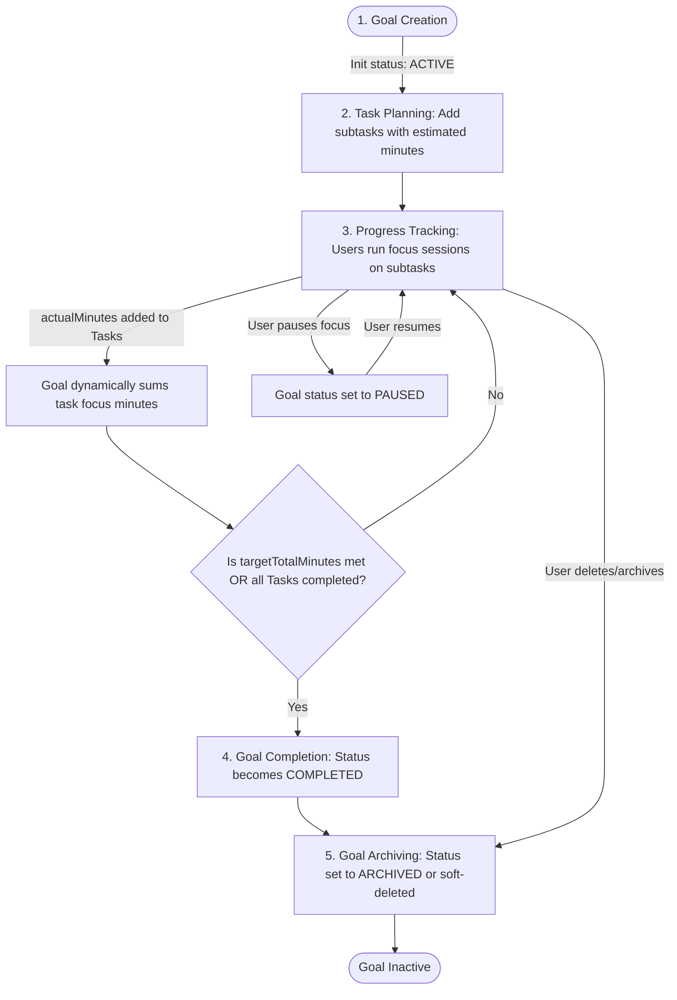
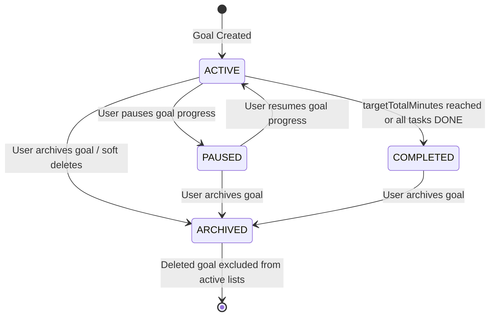
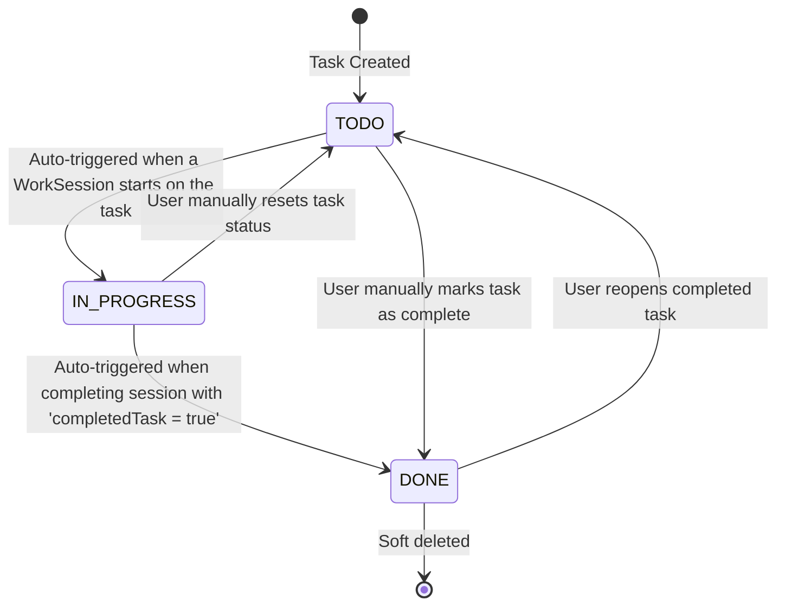

# Goals & Tasks Management

## Goal Lifecycle

This flowchart describes the progression of a goal from its initial creation to ultimate completion and archival.

---

## Goal States

This state transition diagram represents the valid status states of a Goal, mapped to the `GoalStatus` enum.

---

## Task States

This state transition diagram represents the lifecycle states of a Task, mapped to the `TaskStatus` enum.

---

## Goals Business Rules & Constraints

1. **Ownership**: A goal is private to a user by default. Only the owner can view, update, soft-delete, or reorder their private goals.
2. **Dynamic Progress Aggregation**: 
   - A goal does not store accumulated focus minutes statically in its table. 
   - Instead, the total focus minutes are aggregated dynamically from all underlying tasks (`taskRepository.sumLoggedMinutesByGoalIds` or `sumLoggedMinutesByGoalId`).
   - This prevents race conditions and data discrepancy, ensuring the goal's progress is always a 100% accurate reflection of work sessions completed on its subtasks.
3. **Custom Reordering**: Users can customize their workspace layout. The `sortOrder` attribute is updated sequentially using a list of IDs sent by the client. The system updates the indexes from `0` to `N-1` across active goals.
4. **Soft Delete**:
   - Deleting a goal does not perform a database `DELETE` statement. It sets `deletedAt = OffsetDateTime.now()`.
   - This ensures historical focus statistics and heatmaps remain intact. Once a goal is soft-deleted, it is excluded from the active lists and task associations.

---

## Tasks Business Rules & Constraints

1. **Goal Association**: A task must always belong to an active goal.
2. **Reassignment (Moving Tasks)**:
   - A task can be moved to another goal.
   - When a task is updated with a new `goalId`, the backend validates that the target goal exists, belongs to the current user, and is not soft-deleted.
3. **Task Status Transitions**:
   - The lifecycle of a task status is: `TODO` ➔ `IN_PROGRESS` ➔ `DONE`.
   - **Auto-Activation**: When a user starts a new focus session on a task that is currently in the `TODO` status, the backend automatically promotes the task to `IN_PROGRESS`.
   - **Auto-Completion**: When completing a focus session, the user can tick a checkbox indicating they finished the task. If checked, the backend automatically updates the task's status to `DONE` and sets the session as successfully completed.
   - **Manual Override**: The user can update the status of a task manually via the status API endpoint (e.g., reverting a task to `TODO` or marking it `DONE` without a timer session).
4. **Reordering**: Tasks can be reordered within their parent goal. The sorting mechanism operates identically to goals, updating the `sortOrder` index relative to the specific `goalId`.
5. **Soft Delete**: Deleting a task sets `deletedAt = now()`. The task is excluded from active task queries but its work session records are preserved for gamification and heatmap statistics.
