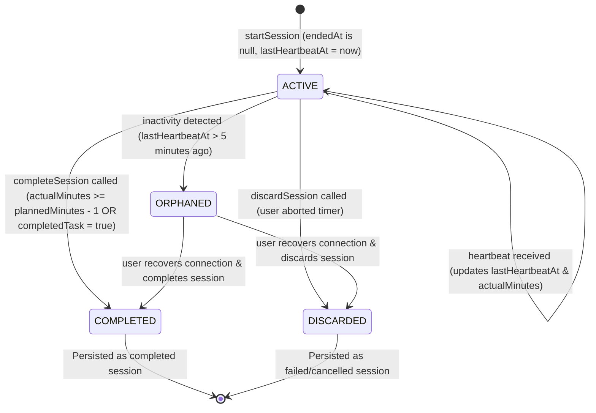
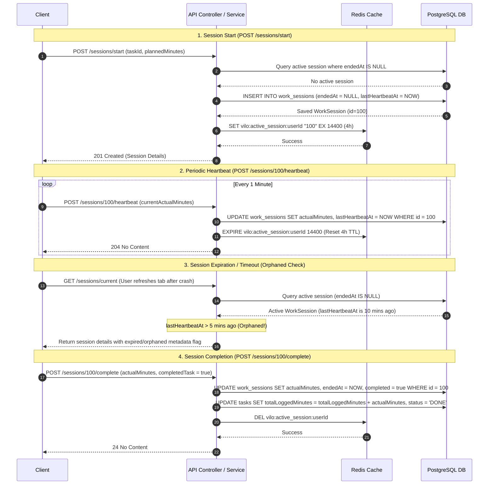

# Focus Sessions & Real-Time Tracking

## Focus Session Lifecycle

This flowchart outlines the lifecycle of a focus session, showing how time tracking integrates with system memory (Redis), persistence (DB), and gamification checks.

```mermaid
flowchart TD
    Start([User starts focus timer]) --> ReqStart[POST /sessions/start]
    ReqStart --> DBCheck{Active Session in DB?}
    
    DBCheck -- Yes --> Error[Throw ValidationException: 'Session already active']
    DBCheck -- No --> CreateSession[Save WorkSession in DB with endedAt=null]
    
    CreateSession --> UpdateTask[Set Task status to IN_PROGRESS if TODO]
    UpdateTask --> CacheRedis[Cache Session ID in Redis: vilo:active_session:userId for 4 Hours]
    CacheRedis --> ActiveSession[Session is Active]
    
    ActiveSession --> Loop[User is working]
    Loop --> Heartbeat[POST /sessions/{id}/heartbeat]
    Heartbeat --> UpdateHeartbeat[Update actualMinutes & lastHeartbeatAt in DB]
    UpdateHeartbeat --> ExtendRedis[Reset Redis TTL to 4 Hours]
    ExtendRedis --> ActiveSession
    
    ActiveSession -- User stops timer --> Complete[POST /sessions/{id}/complete]
    ActiveSession -- User cancels timer --> Discard[POST /sessions/{id}/discard]
    
    Discard --> SetEnded[Set endedAt=now, completed=false in DB]
    SetEnded --> DelRedis[Delete Redis Key]
    DelRedis --> DoneDiscard([Session Discarded])
    
    Complete --> SaveComp[Save actualMinutes & endedAt in DB]
    SaveComp --> CheckTaskComp{User checked completedTask?}
    
    CheckTaskComp -- Yes --> SetTaskDone[Set Task status to 'DONE', session.completed = true]
    CheckTaskComp -- No --> ReachedTimer{actualMinutes >= plannedMinutes - 1?}
    ReachedTimer -- Yes --> SetSessionComp[Set session.completed = true]
    ReachedTimer -- No --> SetSessionFail[Set session.completed = false]
    
    SetTaskDone --> SaveSession[Save WorkSession & add totalLoggedMinutes to Task]
    SetSessionComp --> SaveSession
    SetSessionFail --> SaveSession
    
    SaveSession --> DelRedis2[Delete Redis Key]
    DelRedis2 --> CheckGamify{Is WORK session & actualMinutes > 0?}
    
    CheckGamify -- Yes --> StreakLogic[Update Streak]
    StreakLogic --> BadgeLogic[Check & Award Badges]
    BadgeLogic --> Finished([Session Completed])
    
    CheckGamify -- No --> Finished
```

---

## Work Session States

This state transition diagram represents the lifecycle states of a `WorkSession` based on DB properties and heartbeat recency.



---

## Session Management Flow

This sequence diagram illustrates the detailed interplay between the Client, Controller/Service, Redis Cache, and PostgreSQL database during session execution.



---

## Session Business Rules & Constraints

### 1. Single-Active-Session Enforcement
- A user is restricted to a single active session at any given time.
- The backend queries the database for any session with `endedAt = null` for the user. If found, a `400 Bad Request` (`ValidationException`) is thrown.
- This prevents users from duplicating time logs by running multiple timers in parallel.

### 2. Cache Synchronization (Vite/React Client Sync)
- The backend saves the new session in the database and caches the `sessionId` in Redis under the key `vilo:active_session:<userId>` with a Time-To-Live (TTL) of **4 hours**.
- This Redis key acts as a distributed lock and allows the client to quickly query the current session on startup or page refresh.

### 3. Grace Period (Grace Margin)
- When completing a focus session, the user can tick a checkbox indicating they finished the task. If checked, the backend automatically updates the task's status to `DONE` and sets the session as successfully completed.
- If the task is not completed, the session is marked as completed only if the user stayed focused for the planned duration. The system allows a **1-minute grace margin** (`actualMinutes >= plannedMinutes - 1`) to account for small latency delays in network transit.

### 4. Handling Orphaned Sessions
- An active session is defined as **Orphaned** if its `lastHeartbeatAt` is older than **5 minutes** from the current time (`isOrphaned()`).
- This indicates that the client closed the application, disconnected, or crashed without formally completing or discarding the session.
- Orphaned sessions are detected on client requests (e.g., when the user attempts to view their current session or start a new one). The application handles these by terminating or cleaning them up to allow the user to start a fresh session.
