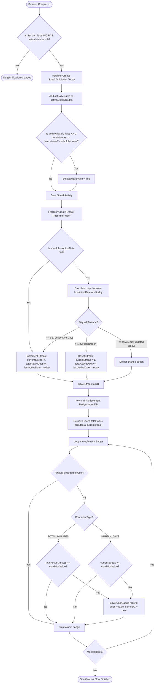

# Gamification: Streaks & Badges Workflow

This flowchart maps the process of evaluating and updating user streaks, followed by checked and awarded achievement badges.

```mermaid
flowchart TD
    Start([Session Completed]) --> CheckWork{Is Session Type WORK & actualMinutes > 0?}
    
    CheckWork -- No --> EndNoGamify([No gamification changes])
    CheckWork -- Yes --> GetActivity[Fetch or Create StreakActivity for Today]
    
    GetActivity --> AddMin[Add actualMinutes to activity.totalMinutes]
    AddMin --> CheckThreshold{Is activity.isValid false AND totalMinutes >= user.streakThresholdMinutes?}
    
    CheckThreshold -- No --> SaveActivity[Save StreakActivity]
    CheckThreshold -- Yes --> SetValid[Set activity.isValid = true]
    
    SetValid --> SaveActivity
    SaveActivity --> GetStreakRecord[Fetch or Create Streak Record for User]
    
    GetStreakRecord --> CheckLastActive{Is streak.lastActiveDate null?}
    
    CheckLastActive -- Yes --> Increment[Increment Streak: currentStreak++, totalActiveDays++, lastActiveDate = today]
    CheckLastActive -- No --> CalcDays[Calculate days between lastActiveDate and today]
    
    CalcDays --> DayDiff{Days difference?}
    
    DayDiff -- "== 1 (Consecutive Day)" --> Increment
    DayDiff -- "> 1 (Streak Broken)" --> Reset[Reset Streak: currentStreak = 1, totalActiveDays++, lastActiveDate = today]
    DayDiff -- "== 0 (Already updated today)" --> NoStreakChange[Do not change streak]
    
    Increment --> SaveStreak[Save Streak to DB]
    Reset --> SaveStreak
    NoStreakChange --> SaveStreak
    
    SaveStreak --> CheckBadges[Fetch all Achievement Badges from DB]
    CheckBadges --> FetchStats[Retrieve user's total focus minutes & current streak]
    
    FetchStats --> LoopStart[Loop through each Badge]
    LoopStart --> CheckAwarded{Already awarded to User?}
    
    CheckAwarded -- Yes --> NextBadge[Skip to next badge]
    CheckAwarded -- No --> CheckCondType{Condition Type?}
    
    CheckCondType -- TOTAL_MINUTES --> MetMin{totalFocusMinutes >= conditionValue?}
    CheckCondType -- STREAK_DAYS --> MetStreak{currentStreak >= conditionValue?}
    
    MetMin -- Yes --> Award[Save UserBadge record: seen = false, earnedAt = now]
    MetMin -- No --> NextBadge
    
    MetStreak -- Yes --> Award
    MetStreak -- No --> NextBadge
    
    Award --> NextBadge
    NextBadge --> LoopEnd{More badges?}
    
    LoopEnd -- Yes --> LoopStart
    LoopEnd -- No --> Finished([Gamification Flow Finished])
```
