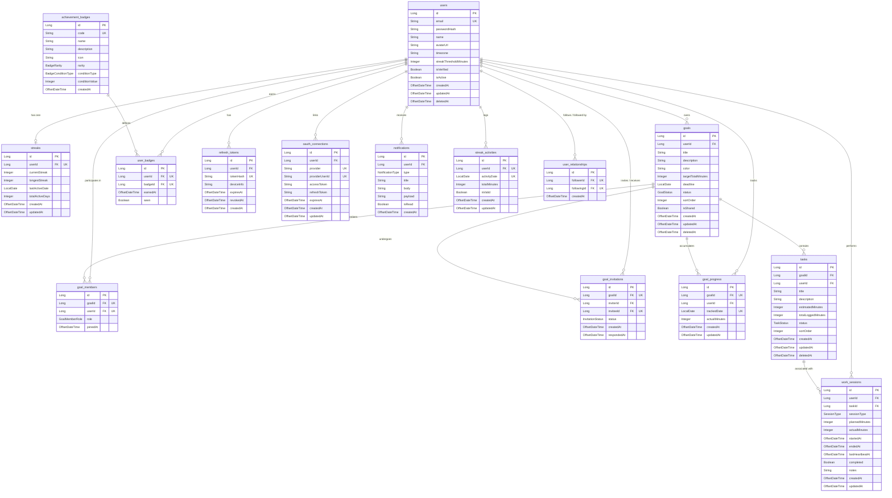

# Entity Relationship Diagram (ERD)

This document represents the database schema and entity relationships for the **MinuteMind** backend. It is derived directly from the JPA entities in the codebase.

